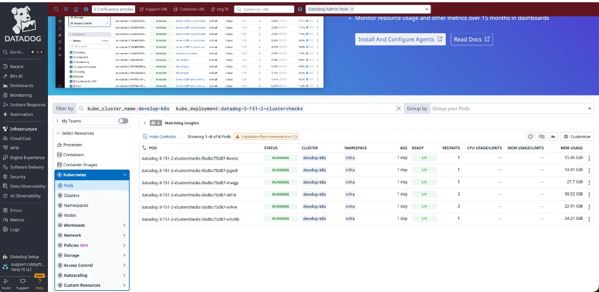
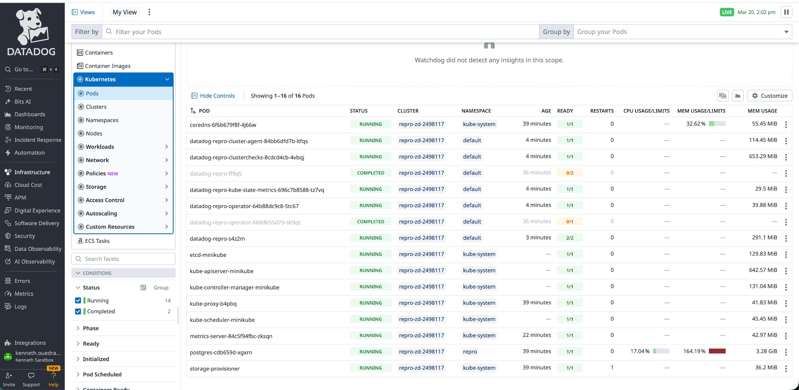
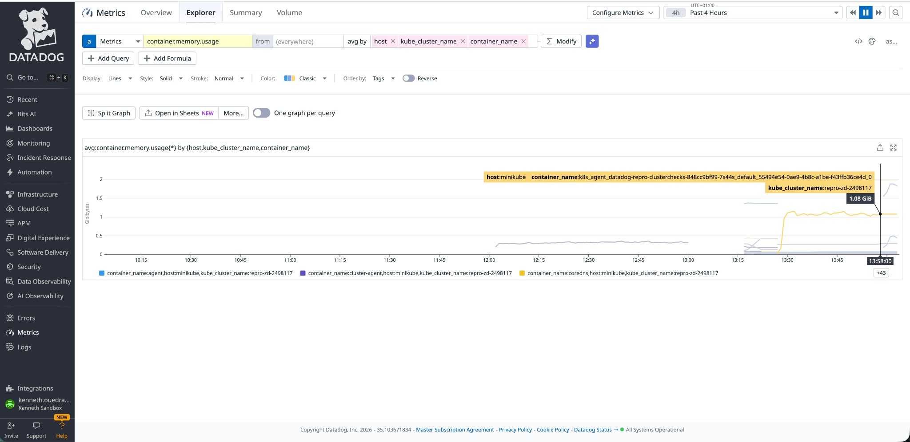

# ZD-2498117 / CONS-8148 — Postgres Check High Memory on CCR Pods

**Ticket**: [ZD-2498117](https://datadog.zendesk.com/agent/tickets/2498117)  
**Jira**: [CONS-8148](https://datadoghq.atlassian.net/browse/CONS-8148)  
**Related**: [SDBM-2278](https://datadoghq.atlassian.net/browse/SDBM-2278) (similar pattern, different customer, Agent 7.73.3)  
**Related**: [CONS-8086](https://datadoghq.atlassian.net/browse/CONS-8086) (engineering review)  
**Investigator**: Kenneth Ouedraogo (TSE2)

---

## 1. Issue

After upgrading Agent from **7.43.1 → 7.74.1** (Helm 3.151.2), CCR pods memory grows to **15–40 GB per pod** within hours.

Customer tried:
- **Doubling CCR replicas** (6 → 12): instances/runner dropped to 26, but **total memory jumped to ~190 GB** ([CONS-8148, Mar 13](https://datadoghq.atlassian.net/browse/CONS-8148))
- **Disabling custom metrics**: memory improved, but **customer says not acceptable** — those metrics are critical

| Metric | Agent 7.43.1 (prod, 6 CCR) | Agent 7.74.1 (dev, 6 CCR) | Agent 7.74.1 (dev, 12 CCR) |
|--------|---------------------------|--------------------------|---------------------------|
| Total CCR memory | ~18 GiB | ~100 GiB | **~190 GiB** |
| Per-pod range | ~3 GiB | ~15–40 GiB | 2–29 GiB |

*Source: customer comments in [CONS-8148](https://datadoghq.atlassian.net/browse/CONS-8148)*


*Customer's Kubernetes Explorer showing CCR pods using 14–30 GiB each on cluster `develop-k8s`*

---

## 2. Environment

- **Cloud**: GKE, `n2d-standard-16` (64 GB), `europe-west3`
- **Agent**: 7.74.1, Helm 3.151.2, Postgres check 23.3.3
- **CCR**: BestEffort QoS (no resource limits)
- **Cluster**: `tabby-dev-gke` (develop-k8s)

### Config actually in use (from flare)

All 52 instances sourced from **Kubernetes service annotations** on `pgb-*` services (NOT from Helm `confd`):

```
Configuration Source: kube_services:kube_service://stage/pgb-tabby-dev-pg-5-dp-ex-feeds-statistics[0]
```
*Source: https://datadog.zendesk.com/attachments/token/gubgvKqRDHs7KeBMBh9Wmp0Cv/?name=postgres_manual_check.log*

Resolved config per instance:
```yaml
relation_regex: ".*"        # matches ALL relations — no schema filter
max_relations: 300           # default, not capped
dbm: false
collect_count_metrics: true
collect_database_size_metrics: true
custom_queries:              # 2 custom queries per instance
  - blocked_query (pg_blocking_pids join)
  - corrupted_index (pg_index WHERE NOT indisvalid)
```

### Dual config source (confirmed)

- **Source A** (Helm `clusterAgent.confd`): `max_relations: 50`, `schemas: [public]`, `dbm: true` — **NOT applied**
- **Source B** (K8s annotations on `pgb-*` services): `max_relations: 300`, `relation_regex: .*`, `dbm: false` — **actually running**

### Memstats from customer flare

The flare contains two CCR pod snapshots:

| Metric | `...clusterchecks-679694c97f-7qhkc` (Mar 17, ~22.6h uptime) | `...clusterchecks-5bdbc75d87-mvqjp` (Mar 19, ~23.8h uptime) | Source |
|--------|--------------------------------------------------------------|--------------------------------------------------------------|--------|
| HeapAlloc | **6.05 GB** | **16.9 GB** | `expvar/memstats` line 192 / `logs/.../expvar/memstats` line 192 |
| HeapObjects | **44.4M** | **128M** | same files, line 195 |
| TotalAlloc | 18.9 TB | 20.2 TB | same files, line 727 |
| GCCPUFrac | 1.55% | 1.9% | same files, line 190 |
| NumGC | 7,040 | 5,710 | same files, line 207 |

*Pod names from `status.log` line 29 (`socket-hostname`) in each flare directory.*

### Flare aggregator data — metrics volume

*Source: `logs/gke-tabby-dev-gke-monitoring-poo 3/expvar/aggregator`*

```
ChecksMetricSample: 3.46 billion total
SeriesFlushed:      3.45 billion
Series per flush:   ~228,000
Number of flushes:  5,699
```

Notable outlier checks (from `expvar/runner`):

| Check | MetricSamples/run | TotalMetricSamples | Avg exec time |
|-------|-------------------|-------------------|---------------|
| `pg-5-replica-0-dp-features-store` | **61,748** | **1,605,455** | 1,935 ms |
| `pg-25-dp-features-store` | **35,863** | **789,057** | 967 ms |
| `pg-01-ep-notify` | **12,892** | **283,590** | 336 ms |
| typical check | ~1,400 | ~30,000 | ~250 ms |

One check (`pgb-tabby-dev-pg-01-ep-dba-replica-invoices`) is failing: `FATAL: database "invoices" does not exist` — 22 errors, 0 successes.

---

## 4. Reproduction

### Setup

Deployed on **minikube** (4 CPU, 12 GB) via Helm:
- Agent **7.74.1** (exact version)
- **52 Postgres instances** with exact Source B config
- Postgres 16, **52 databases × 300 tables** each
- CCR with **no resource limits** (BestEffort)
- 1 CCR replica (all 52 checks on one pod)


### Test 1: Source A (Helm confd) delivery

*Source: `kubectl top pod` + `curl http://localhost:5000/debug/vars` on CCR pod*

| Metric | Baseline | T+5min | T+10min |
|--------|----------|--------|---------|
| Container RSS | — | 1,154 Mi | 1,214 Mi |
| HeapAlloc | 845 MB | 600 MB | 930 MB |
| TotalAlloc | 59.9 GB | 86.6 GB | 130 GB |

**Result: Stable ~1.2 GiB.**

### Test 2: Source B (kube_services annotations) delivery — same as customer

*Source: `kubectl top pod` + `curl http://localhost:5000/debug/vars` on CCR pod*

| Metric | Baseline | T+5min | T+10min |
|--------|----------|--------|---------|
| Container RSS | 1,218 Mi | 1,191 Mi | 1,163 Mi |
| HeapAlloc | 527 MB | 560 MB | 849 MB |
| TotalAlloc | 41.6 GB | 68.8 GB | 98.1 GB |
| GCCPUFrac | 0.82% | 0.86% | 0.84% |

**Result: Stable ~1.2 GiB. Same as Source A.**

### All memstats compared

| Metric | Repro Source A | Repro Source B | `...7qhkc` (Mar 17) | `...mvqjp` (Mar 19) |
|--------|---------------|---------------|----------------------|----------------------|
| Container RSS | ~1.2 GiB (stable) | ~1.2 GiB (stable) | n/a | 15–37 GB (screenshot) |
| HeapAlloc | 930 MB | 849 MB | **6.05 GB** | **16.9 GB** |
| HeapObjects | 6.3M | 6.3M | **44.4M** | **128M** |
| GCCPUFrac | ~1% | 0.84% | 1.55% | 1.9% |
| TotalAlloc | 130 GB (~10min) | 98.1 GB (~10min) | 18.9 TB (~22.6h) | 20.2 TB (~23.8h) |
| Source | `curl debug/vars` | `curl debug/vars` | `expvar/memstats` | `logs/.../expvar/memstats` |




---

## 5. pprof heap profile — reproduction CCR (~45 min uptime)

*Source: `curl -s 'http://localhost:5000/debug/pprof/heap?debug=1'` on CCR pod*

```
HeapAlloc:     568 MB
MaxRSS:        1.33 GB
TotalAlloc:    229 GB
HeapObjects:   6.3 million
GCCPUFrac:     0.93%
NumGC:         536
```

### Top Go allocators (live memory)

| Live Memory | Function |
|------------|----------|
| 7.6 MB | `stream.(*Compressor).Close` |
| 1.3 MB | `aggregator.(*contextResolver).trackContext` |
| 1.3 MB | `aggregator.(*CheckSampler).commitSeries` |
| 1.1 MB | `metrics.ContextMetrics.AddSample` |
| 0.05 MB | `tags.(*Store).Insert` |
| 0.02 MB | `python.(*stringInterner).intern` |

No function holds more than 7.6 MB. No pprof is available from the customer's pods.

---

## 6. Conclusions

### Confirmed
- Config source mismatch: Source A (Helm confd) not applied, Source B (annotations) is active
- BestEffort QoS allows unbounded growth (no memory limit set)
- Customer's HeapAlloc (6.05 GB on `7qhkc`, 16.9 GB on `mvqjp`) and HeapObjects (44.4M / 128M) are far above reproduction values (568–930 MB / 6.3M) with the same config and Agent version
- GCCPUFrac is low (1.5–1.9%) even with 16.9 GB heap — GC is not struggling, seems it simply cannot free objects that are still referenced
- Seems on Agent 7.43.1, same checks ran at ~3 GiB/pod (customer's own prod baseline from CONS-8148)

### Ruled out by reproduction
- **Config parameters** (relation_regex, max_relations, custom queries) did not trigger the leak alone on my side
- **Config delivery method** (confd vs kube_services annotations) makes no difference
- **Instance count** (52 instances on 1 CCR pod) does not trigger the leak in ~45 min

### Not yet determined
- Whether the leak needs **hours/days** to manifest (repro ran ~45 min, customer pods ran 22.5h+)
- Exact Go code path responsible (no pprof available from customer pods)

---

## 7. Next Steps

1. **Let reproduction run 12-24h** to check if the leak is time-dependent

2. **Request pprof heap profile** from customer while memory is high ?
   ```bash
   kubectl exec <CCR> -- curl -o heap.prof http://localhost:5000/debug/pprof/heap
   ```

3. **Compare with Agent 7.43.1** — same 52-instance setup with old version to confirm regression

4. **Double check with TEEs**

---

## Repository Structure

```
.
├── README.md
├── screenshots/
│   ├── customer-ccr-memory-develop-k8s.png   # Customer's actual CCR memory
│   ├── repro-k8s-explorer.png                # Reproduction K8s Explorer
│   └── repro-container-memory.png            # Reproduction container.memory
└── reproduction/
    ├── docker-compose.yaml                   # Docker Compose repro (10 inst)
    ├── init-postgres.sh
    ├── monitor-memory.sh
    ├── conf.d/
    │   └── postgres.yaml
    └── k8s/
        ├── datadog-values.yaml               # Helm values Source A (confd)
        ├── datadog-values-source-b.yaml      # Helm values Source B (no confd)
        ├── pgb-services-annotated.yaml       # 52 annotated K8s services
        ├── postgres-deployment.yaml
        └── init-postgres-52.sh
```
